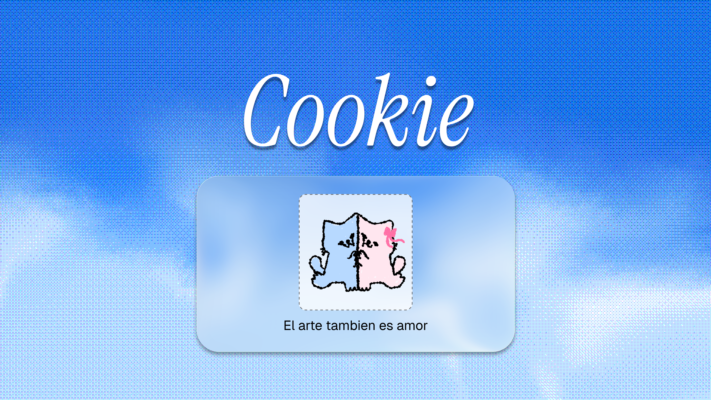

<div align="center">

# Cookie

[](https://bun.sh)
[](./LICENSE)
[](./apps/web)
[](./apps/android)
[](./SSD%20PROYECT/08-clients-and-android-widget.md)
[](./packages/protocol)

**Dibujo compartido para dos. El arte también es amor.**\
App privada para que dos personas se envíen dibujos y compartan un historial común, desde el navegador de PC y desde Android.

[Diseño (SSD)](./SSD%20PROYECT/README.md) · [Quickstart](#quickstart) · [Estructura](#estructura) · [Roadmap](#roadmap)

</div>



> Fuente de verdad del diseño: [`SSD PROYECT/`](./SSD%20PROYECT/README.md) (v1.1, 12 caps).

---

## Qué es

- **PairSpace:** espacio compartido para 2 miembros, con historial común ordenado por el servidor.
- **Onboarding mínimo:** nombre visible obligatorio, foto opcional, emparejamiento por invitación aleatoria de un solo uso.
- **Dibujo:** grafito, lápiz de color y rotulador para el MVP. Acuarela se pospone.
- **Publicación inmutable:** un dibujo confirmado no se edita; corregir = nueva publicación (salvo tombstone).
- **Offline-first:** borradores y publicaciones pendientes viven en local hasta que el backend confirma.
- **Tiempo real best-effort:** WebSocket acelera, D1 es la verdad. Al reconectar: replay por `seq`, snapshot si `CURSOR_EXPIRED`.
- **Android:** widget nativo que intenta actualizarse al llegar un dibujo (FCM + trabajo en background). Sin promesa de instantáneo — doze / OEM / force-stop mandan.

Fuera del MVP: grupos, feed público, edición colaborativa simultánea del mismo lienzo, capas, importación de imágenes, animación de trazos, E2EE.

## Stack

| Capa | Tech |
|---|---|
| Monorepo | Bun workspaces, TypeScript-only (`allowJs:false`) |
| Web | React + Vite + Tailwind v4 (oklch) + shadcn `new-york` + lucide-react |
| Android | Capacitor (reusa `apps/web/dist`) + Kotlin nativo para widget / FCM |
| Backend | Cloudflare Workers (API delgada) + Durable Object `PairRoom` + Queue/Jobs |
| Datos | D1 (metadatos + eventos + idempotencia), R2 (documentos + renders) |
| Push | Firebase Cloud Messaging → widget Android |
| Protocolo | zod v1, `schemaVersion: 1`, `Idempotency-Key` en mutaciones reintentables |
| Calidad | Biome + `tsc --noEmit` + Vitest. Orden CI: `lint → typecheck → test → build` |

Identidad visual: `Instrument Serif` → `--font-serif` / display, `Geist Pixel Square` → `--font-pixel` (única pixel), bundle local en `apps/web/public/fonts/` (nada de CDN en runtime, APK offline).

## Estructura

```text
apps/web/         # ÚNICA UI React+Vite+TS
apps/android/     # Wrapper Capacitor, SIN UI propia + proyecto nativo versionado
packages/core/    # dominio puro: PairSpace, Membership, Drawing, Draft, Installation
packages/protocol/# schemas zod v1 HTTP/WS + tipos
packages/drawing/ # modelo puntos/trazos, DrawingEngine, sin DOM/React
packages/sync/    # outbox, cursors, retries (reloj/transporte inyectados)
packages/storage/ # interfaces + codecs, sin cloud SDK
packages/ui/      # re-export shadcn puros, sin reglas de dominio
packages/platform-web / platform-capacitor/  # implementan puertos core
server/api realtime(PairRoom DO) jobs db/    # Worker delgado → use case → repo
infra/wrangler firebase/  docs/adr/  SSD PROYECT/
```

Regla de dependencias:

```text
apps/*, server/api → core + protocol + drawing + sync
core NO importa React, DOM, Capacitor, Cloudflare, D1, R2, Firebase.
Capacidades vía puertos: SecureCredentialStore, LocalRepository, PlatformCapabilities.
```

## Principios duros

- **ACK solo tras commit D1** (Drawing + Event + Idempotency). WS/DO es fanout, no verdad.
- **Idempotencia:** misma key + mismo hash = mismo resultado; distinto hash = `409`.
- **Auth:** bearer corto en memoria, refresh en store seguro (web: no `localStorage`; Android: Keystore vía plugin). WS con ticket de 1 uso de segundos. Hashes en backend, nunca secretos en logs.
- **R2/D1/FCM nunca desde UI.** Keys R2 server-generated. Sin base64 en SQL/WS/logs/push.
- **Widget/FCM = best-effort.** Mostrar siempre última preview + timestamp.

## Quickstart

Requisitos: [Bun](https://bun.sh) 1.4.2+, JDK 21 solo para APK (Gradle 8.14 no corre en Java 25), Android SDK para móvil.

```sh
bun install --frozen-lockfile
cp .env.example .env   # nunca commitear secretos

bun run lint       # biome check
bun run typecheck  # tsc --noEmit por workspace
bun run test       # vitest run
bun run check      # lint + typecheck + test
```

Dev:

```sh
bun --filter ./apps/web dev        # SPA local
bun --filter ./server/api dev      # Worker local (necesita COOKIE_API_URL / VITE_API_URL)
```

Build:

```sh
bun run build:web      # vite build apps/web
bun run build:worker   # wrangler deploy --dry-run / build server
bun run build:android  # web build + cap sync
```

Variables (`[.env.example`](./.env.example)):

```sh
COOKIE_API_URL=http://localhost:8787
VITE_API_URL=http://localhost:8787
VITE_PROTOCOL_VERSION=1
# CLOUDFLARE_API_TOKEN / ACCOUNT_ID → solo staging/prod vía dashboard/CI
# FCM_SERVER_KEY → solo Android push (H6)
```

APK debug (Windows):

```powershell
$env:JAVA_HOME="C:\Program Files\Java\jdk-21"
$env:ANDROID_HOME="$env:LOCALAPPDATA\Android\Sdk"
bun run build:android
# luego assembleDebug desde apps/android/android
```

Notas Android: `minSdk 29`, `compile/target 35`. Proyecto nativo `apps/android/android/` versionado. Solo `local.properties` y `*/build/` van gitignored.

## Estado de sync (contrato UI)

Todo dibujo muestra uno de: `local → pendiente → enviado → confirmado → error`. El core expone estados y comandos; la UI no contiene reglas de autorización ni lógica de sync.

## Documentación

- Diseño completo: [`SSD PROYECT/00-README`](./SSD%20PROYECT/README.md) + caps `01`–`12`.
  - Producto: `01-product-scope.md`
  - Arquitectura: `02-architecture-and-repo.md`
  - Backend: `04-backend-design.md`
  - Sync: `06-realtime-and-offline.md`
  - Drawing: `07-drawing-engine.md`
  - Clientes + widget: `08-clients-and-android-widget.md`
  - Seguridad: `10-security-privacy.md`
- Decisiones: [`docs/adr/`](./docs/adr/) (plantilla en `ADR-000-template.md`).
- Agentes: [`AGENTS.md`](./AGENTS.md) — comandos y reglas duras del repo.

## Roadmap

- H0–H1: fundaciones (monorepo, UI base, tokens, fuentes) — en curso.
- H2: pairing + PairSpace.
- H3: motor de dibujo (grafito / color / rotulador, 55–60 FPS).
- H4: timeline + publicación inmutable.
- H5–H6: sync offline + realtime + widget Android + FCM.
- Después: acuarela, E2EE (requiere rediseño antes de prod).

Ver preguntas abiertas y riesgos en [`SSD PROYECT/12-decisions-roadmap.md`](./SSD%20PROYECT/12-decisions-roadmap.md).

## Licencia

MIT — ver [LICENSE](./LICENSE). © 2026 Luxury.dev
