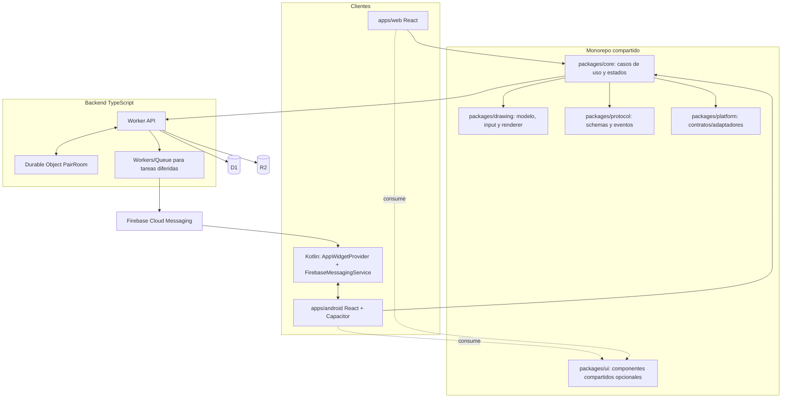

# 2. Arquitectura y monorepo

## 2.1 Reglas arquitectónicas

1. El dominio y las reglas de negocio pertenecen a `packages/core`, no a React ni a rutas HTTP.
2. Las dependencias apuntan hacia contratos estables: aplicaciones y adaptadores consumen el core; el core no importa implementaciones concretas de plataforma.
3. El dibujo en curso es local y responde al input sin llamadas de red. El servidor participa en publicación, orden, persistencia y sincronización.
4. Un dibujo confirmado es inmutable. Correcciones posteriores se modelan como otra publicación, excepto metadatos administrativos/tombstones.
5. D1 y R2 son persistencia; Durable Objects coordinan sesiones y distribución realtime. El estado en memoria no es durable.
6. Los clientes pueden confiar en un ACK firmado por el resultado del servidor, no en haber enviado bytes o recibido un evento WebSocket.
7. Las UIs quedan libres para que la persona responsable seleccione componentes shadcn, estilos, paleta y fuentes. El core expone estados y comandos, no decisiones visuales.

## 2.2 Diagrama de componentes



## 2.3 Estructura propuesta

```text
repo/
  package.json
  bun.lock
  tsconfig.base.json
  biome.json                         # o ESLint + Prettier, elegir una política
  apps/
    web/                             # SPA/SSR según necesidad, React + TypeScript
    android/                         # React build servido por Capacitor
      android/                       # proyecto nativo versionado
        app/src/main/java/.../widget/ # Kotlin AppWidgetProvider y RemoteViews
        app/src/main/java/.../push/   # Kotlin FirebaseMessagingService
        app/src/main/java/.../plugins/# plugin Capacitor si hace falta
  packages/
    core/                            # entidades, use cases, políticas, state machines
    protocol/                        # schemas request/response/WS, compatibilidad
    drawing/                         # puntos, trazos, herramientas, render e historial
    sync/                            # outbox, cursors, retries, reconciliation
    storage/                         # interfaces + codecs/versionado; no cloud SDK
    ui/                              # opcional, selección visual a cargo del producto
    platform-web/                    # IndexedDB, auth web, lifecycle, WebSocket
    platform-capacitor/              # SQLite, Secure Storage, bridge nativo
  server/
    api/                             # Cloudflare Worker: rutas, auth, validation
    realtime/                        # Durable Object PairRoom y protocolo WS
    jobs/                            # colas, push, GC, mantenimiento
    db/                              # migrations SQL, queries y repositorios
    tests/                           # pruebas integración worker/DO/DB
  infra/
    wrangler/                        # bindings por entorno, migrations, límites
    firebase/                        # configuración no secreta y documentación
  docs/                              # ADR y runbooks
```

## 2.4 Límites y responsabilidades de paquetes

### `packages/core`

- Entidades: `PairSpace`, `Membership`, `Drawing`, `Draft`, `Installation`.
- Casos de uso: `CreateDrawing`, `PublishDrawing`, `LoadTimeline`, `AcceptInvite`, `RecoverPairSpace`, `RevokeInstallation`.
- Validación de reglas del producto y transiciones de estados.
- Contratos de repositorios, reloj, identificadores, telemetría y transporte.
- No importa React, Capacitor, Cloudflare, D1, R2, Firebase ni APIs DOM.

### `packages/protocol`

- Schemas versionados para HTTP, eventos WS y comandos offline.
- Validación runtime de datos recibidos desde red.
- Generación compartida de tipos, sin convertir tipos TypeScript en validación implícita.
- Versionado explícito: protocolo `v1`, formato de dibujo `schemaVersion: 1`.

### `packages/drawing`

- Modelo canónico de puntos y trazos.
- Interfaz de entrada Pointer Events aislada del ciclo de vida React.
- Pipeline de render local; control de presión, interpolación, textura y composición.
- Adaptador de Canvas 2D inicialmente; API de render no acoplada a Canvas.
- No conoce el usuario, pairing ni API de nube.

### `packages/sync`

- Outbox local durable y estados de publicación.
- Retries con backoff/jitter, idempotency keys y reconciliación por cursor.
- Debe ser determinista y comprobable con reloj/transporte falsos.

### `packages/platform-*`

- Implementa los puertos del core: persistencia local, almacenamiento seguro, conectividad, notificación, deep link y lifecycle.
- El código web puede usar IndexedDB; Android usa SQLite y el puente nativo seguro.
- Las diferencias se expresan como capacidades, no como condicionales esparcidos por dominio.

### `server/*`

- El API autentica, autoriza, valida, limita y persiste comandos.
- El Durable Object coordina sockets por PairSpace y comunica eventos ya confirmados.
- Jobs gestionan notificación, GC de objetos huérfanos, mantenimiento y tareas reintentables.
- Repositorios encapsulan SQL; el dominio no construye SQL dentro de rutas.

## 2.5 Regla de dependencia

```text
apps/web ───────┐
apps/android ───┼──> packages/core + drawing + protocol + sync
server/api ─────┘
                     ↑
           contracts/ports only

platform-web, platform-capacitor, server adapters implementan los puertos.
```

Evitar ciclos entre paquetes. Un paquete no debe depender de otro por rutas internas no exportadas. Cada workspace define `exports`, `types`, `sideEffects` y `tsconfig` propios.

## 2.6 Estado compartido y estado efímero

- **Persistente local:** drafts, outbox, cursores aplicados, cache de timeline y preferencias técnicas.
- **Persistente nube:** miembros, perfil mínimo, dibujos publicados, eventos y revocaciones.
- **Efímero cliente:** posición actual del puntero, preview de trazo, panel/tool activo.
- **Efímero server:** sockets vivos, presencia aproximada y suscriptores.
- **Prohibido:** que presencia o memoria del DO sea requisito para recuperar un dibujo.
