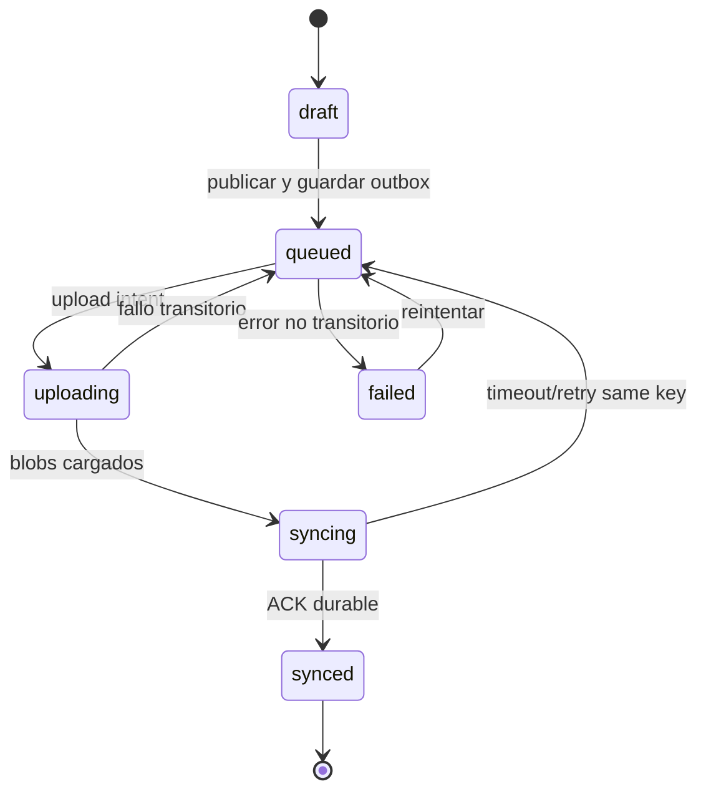

# 6. Tiempo real, offline e idempotencia

## 6.1 Fuentes de verdad

1. D1 define si el dibujo existe, quién lo creó y su secuencia de evento.
2. R2 define bytes de documento y render ligados por clave/hash validado.
3. El cliente define solo su estado local pendiente y drafts no publicados.
4. Durable Object distribuye eventos a sockets, pero no conserva la única copia.
5. FCM despierta/avisa al Android, pero no transporta el historial ni es fuente de verdad.

## 6.2 WebSocket

Autenticación mediante ticket temporal obtenido por HTTPS:

```text
GET /v1/pair-spaces/{id}/realtime
Upgrade: websocket
Sec-WebSocket-Protocol: pair.v1
Authorization: ticket de un solo uso en header si la plataforma lo soporta
```

Si alguna plataforma obliga query parameter, el ticket debe ser de un solo uso, durar segundos, no contener el bearer base y excluirse de access logs. Tras aceptar socket, se consume ticket y se autentica membresía.

Handshake:

```json
{"type":"hello","protocol":1,"lastEventSeq":41,"installationId":"ins_opaque"}
{"type":"ready","currentSeq":42,"serverTime":"2026-10-09T12:00:00.000Z"}
```

Tipos mínimos:

| Evento | Dirección | Contenido / uso |
|---|---|---|
| `drawing.created` | servidor → cliente | `eventId`, `seq`, `drawingId`, `authorUserId`, `createdAt`, `previewVersion`. |
| `drawing.deleted` | servidor → cliente | tombstone y `seq`. |
| `profile.updated` | servidor → cliente | nombre/avatarVersion de miembro. |
| `presence.changed` | servidor → cliente | estado aproximado; efímero y no autoritativo. |
| `sync.ack` | servidor → cliente | cursor máximo durable aplicado. |
| `client.resync` | cliente → servidor | pide replay desde cursor; respuesta puede indicar snapshot requerido. |
| `ping` / `pong` | ambos | detectar socket muerto, nunca confirma persistencia. |

Reglas:

- Payload máximo 64 KiB; no transportar documento ni imagen por WS.
- DO puede reiniciar, hibernar o cerrar sockets durante despliegue; cliente reconecta.
- Enviar evento solo después de commit D1.
- Fanout a conexiones de PairSpace; el servidor verifica que el socket siga activo/membership vigente.
- Coalescer ráfagas de presencia; no retrasar `drawing.created` confirmados.
- Backpressure: si socket no consume o buffer crece, cerrarlo con código recuperable; replay por API al volver.

## 6.3 Reintento y reconexión

- Backoff exponencial con jitter: base 1 s, máximo 30 s, reset tras sesión estable.
- Reautenticar con credencial/refresh válido; nunca reusar ticket vencido.
- Tras `ready`, comparar `lastEventSeq` con servidor y pedir replay.
- Detectar huecos: si llega `seq > lastSeq + 1`, suspender aplicación del orden y pedir delta.
- Duplicados de eventos se ignoran por `eventId`/`seq` aplicado.
- Si el server retorna `snapshotRequired`, cargar timeline y sincronizar cursor en una operación de reconciliación.
- App vuelve a foreground: refrescar cursor en red si está disponible, aun con WS aparentemente abierto.

## 6.4 Máquina de estados local



| Estado | Significado | Acción permitida |
|---|---|---|
| `draft` | Solo local, editable. | Seguir dibujando, descartar o publicar. |
| `queued` | Publicación persistida localmente. | Reintentar al recuperar red. |
| `uploading` | Blobs transfiriéndose. | Continuar/reintentar por blob hash. |
| `syncing` | Comando enviado, ACK pendiente. | Repetir misma mutation key o consultar resultado. |
| `synced` | Confirmado por el backend. | Mostrar en timeline; documento publicado inmutable. |
| `failed` | Error que requiere acción. | Explicar si corregible y permitir retry/descartar. |

## 6.5 Outbox y publicación idempotente

Registro local de outbox contiene `clientMutationId`, `drawingId`, versión de schema, hash, estado, attempts, nextAttemptAt y claves temporales de upload. Transacción local guarda draft, blobs y outbox antes de network.

Pseudocódigo:

```ts
async function publishDraft(draftId: DraftId) {
  const command = await localStore.createOrGetPublishCommand(draftId);
  // mutationId se genera y persiste una sola vez antes del primer envío
  await uploader.ensureUploaded(command.blobs);
  const result = await api.createDrawing(command.payload, {
    idempotencyKey: command.clientMutationId,
  });
  await localStore.markSynced(command.clientMutationId, result.eventSeq);
}
```

- Misma key y mismo hash: devolver resultado ya confirmado.
- Misma key y distinto hash: error definitivo; no mutar silenciosamente.
- Timeout sin respuesta: conservar estado `syncing`; retry con la misma key.
- Upload huérfano: GC, sin impacto en timeline.
- Si un ACK llega después del timeout, mergear por `clientMutationId` y no crear una segunda pieza.

## 6.6 Conflictos

- No hay edición multiusuario concurrente de la misma pieza en MVP.
- Dibujos publicados son append-only; la cronología se ordena por cursor del servidor.
- Edición de perfil puede usar `updatedAt` y revisión optimista; se acepta última escritura del servidor.
- Borrado crea tombstone para que ambos clientes converjan.
- Modo offline no puede revocar remotamente una copia descargada hasta reconexión; privacidad de dispositivo debe comunicarse.
- Reloj local se usa solo para “creado en este dispositivo” opcional, nunca para ordenar la historia compartida.

## 6.7 Push y reconcilación

- Al publicar, añadir job FCM a outbox server-side luego del commit.
- Enviar notificación/data mínima: event cursor/event id opaco, sin dibujo, URL firmada ni secreto.
- Deduplicar notificaciones por instalación y event id; colapsar varios eventos para que cliente pida delta.
- Si FCM avisa que hubo mensajes borrados o el cliente detecta salto, hacer full sync.
- Push fallido no revierte dibujo; la app actualizará al abrir o reconectar.
