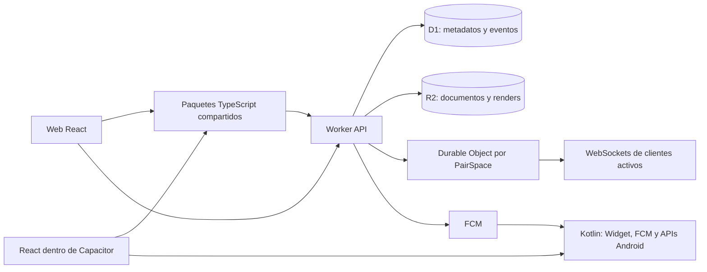

# SDD de la aplicación de dibujo compartido

**Versión:** 1.1 · 9 de octubre de 2026  
**Estado:** propuesta técnica para implementación; las preguntas que requieren decisión están en [12-decisions-roadmap.md](12-decisions-roadmap.md).

Este paquete define una aplicación privada de dibujo compartido para dos personas, con cliente web para PC y APK Android. El diseño prioriza un núcleo de dominio TypeScript reutilizable, render fluido, sincronización resistente a redes inestables, backend autoritativo y una ruta de crecimiento que no obligue a reescribir el producto.

La propuesta de stack usa Bun workspaces, React, Capacitor, Cloudflare Workers, Durable Objects, D1 y R2. Es una base candidata de bajo costo operativo, no una garantía de gratuidad. Antes de desplegar producción se deben confirmar cuotas, tarifas, regiones, requisitos de publicación y versiones soportadas.

## Decisiones de producto confirmadas

- Un historial compartido contiene todos los dibujos publicados por ambos miembros.
- Al desvincular o reinstalar una app, el historial sigue en la nube. La recuperación requiere autorización, no basta conocer el nombre o el ID del espacio.
- Android tendrá un widget nativo que intentará actualizarse al llegar un dibujo, incluso con la app cerrada, cuando Android permita procesar el evento. No se promete latencia instantánea ni ejecución garantizada.
- MVP de herramientas: grafito, lápices de color y rotulador con texturas; acuarela queda para una etapa posterior.
- Onboarding mínimo: nombre visible requerido, foto opcional, emparejamiento por invitación.
- Web y Android comparten lógica y, donde sea conveniente, componentes React. El proyecto Android conserva código Kotlin para el widget, FCM y APIs nativas.
- La persona usuaria se encargará de la dirección visual, la paleta, las fuentes y la selección de componentes shadcn. Este SDD no impone una identidad visual.

## Lectura recomendada

1. [01-product-scope.md](01-product-scope.md) — objetivos, alcance, requisitos y vocabulario.
2. [02-architecture-and-repo.md](02-architecture-and-repo.md) — arquitectura, monorepo, límites entre cores y flujo de dependencias.
3. [03-stack-and-decisions.md](03-stack-and-decisions.md) — tecnologías candidatas, alternativas y criterios de selección.
4. [04-backend-design.md](04-backend-design.md) — servicios, API, autorización, límites y contratos.
5. [05-data-and-storage.md](05-data-and-storage.md) — modelo de dominio, SQL, objetos y recuperación.
6. [06-realtime-and-offline.md](06-realtime-and-offline.md) — WebSocket, eventos, cola offline e idempotencia.
7. [07-drawing-engine.md](07-drawing-engine.md) — modelo de trazos, herramientas, render y fluidez del lienzo.
8. [08-clients-and-android-widget.md](08-clients-and-android-widget.md) — web, Capacitor, almacenamiento local y widget nativo.
9. [09-performance-and-scale.md](09-performance-and-scale.md) — presupuestos, profiling, optimización y escalado.
10. [10-security-privacy.md](10-security-privacy.md) — amenazas, credenciales, pairing, recuperación y privacidad.
11. [11-operations-testing-costs.md](11-operations-testing-costs.md) — CI/CD, pruebas, observabilidad, despliegue y costos.
12. [12-decisions-roadmap.md](12-decisions-roadmap.md) — preguntas, ADR, riesgos, hitos y aceptación.

## Lenguaje normativo

- **MUST / DEBE:** condición obligatoria para cumplir el diseño.
- **SHOULD / DEBERÍA:** práctica recomendada; una excepción requiere razón registrada.
- **MAY / PUEDE:** opción permitida.

## Vista rápida del sistema

## Principio central de consistencia

El servidor confirma la publicación solo después de persistir metadatos y evento. Un WebSocket acelera la propagación, pero no es la fuente de verdad. Si la respuesta se pierde, el cliente repite el mismo comando idempotente. Al reconectar, pide cambios desde su último cursor o recarga un snapshot.

## Fuentes técnicas

Los límites y precios cambian. La sección de costos enlaza documentación primaria de Cloudflare, Android, Capacitor y Firebase que debe revalidarse antes de producción.
